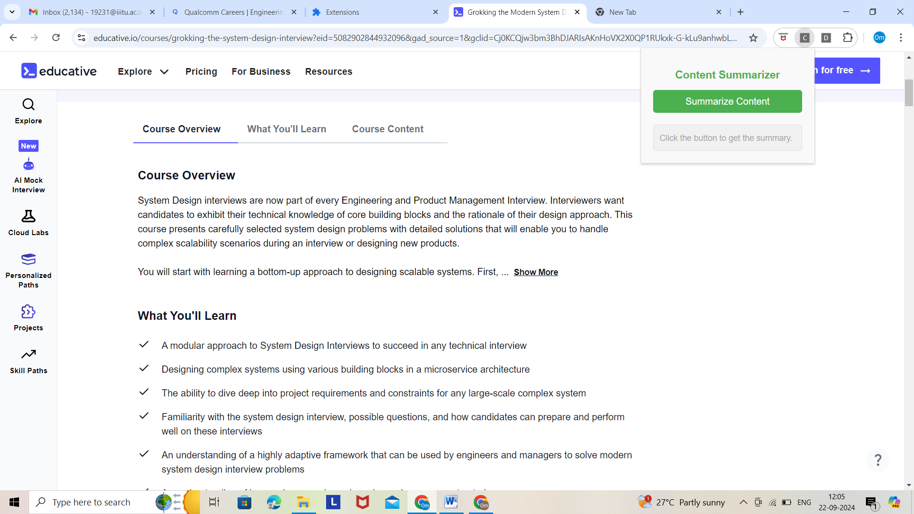
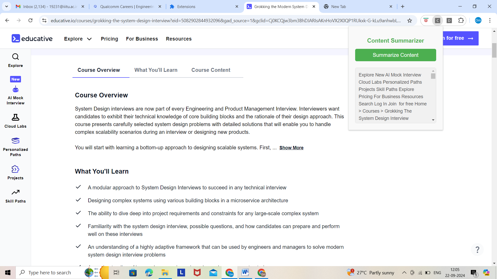

# Content Summarizer Chrome Extension




Content Summarizer is a simple Chrome extension that allows users to quickly summarize the content of a webpage by extracting the first few sentences of the text. The extension is lightweight, easy to use, and can be further enhanced to support more complex summarization techniques.


## Features

- Summarizes content from any webpage.
- Provides a clean and intuitive popup interface.
- Responsive and user-friendly design.
- Summarizes the first 5 sentences of the webpage's text.
- No icons required for the extension.


## Installation

To run this project locally, follow these steps:

1. Clone the repository:

    ```bash
   https://github.com/omgupta7352/Content-Summary-Extension.git
    ```

2. Load the extension in Chrome

- Open Chrome and go to ``` chrome://extensions/ ```.
- Enable Developer mode in the top-right corner.
- Click on Load unpacked and select the folder containing the extension files ```(content-summarizer)```.
- The extension will now be added to your browser's toolbar.

3. Using the extension in Chrome

- Navigate to any webpage.
- Click the Content Summarizer extension icon (or use the Extensions menu to find it).
- Click the Summarize Content button in the popup.
- The extension will display a summary of the first few sentences from the page's text.
